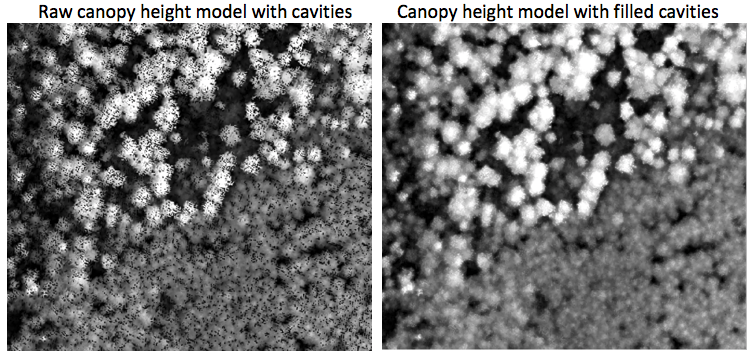

# **chm_prep**

## What chm_prep does

High resolution airborne lidar Canopy Height Models (CHMs), or Digital Surface Models (DSM) often present **small cavities** over forest canopies (see the left part of the figure below). These are caused by laser pulses travelling deep below the generalized *crown envelope*. They may also show **spikes** caused by high noise if it was not properly removed from the point cloud before creating rasters products such as CHMs. Finally, no-data areas or **isolated no-data pixels**
 may also cause problems. chm_prep does several things to improve CHMs or DSMs before they are used for, say, individual tree crown (ITC) extraction, or image orthorectification using a lidar DSM as the 3D source. It was designed to:
- removes cavities and spikes;
- saturate the values to a minimum (e.g., 0.0 m for a CHM) and to a maximum;
- get rid of isolated no-data pixels.

It **leaves all non-problematic pixels unchanged**, so it is quite more targeted than, say, a simple median filter apply to an entire CHM. It is made for production, so it runs very fast, and is by default a batch mode processor. The user control all the processing parameters though an `.ini` file.

## Installing chm_prep

### Code structure

chm_prep is made of a Python script (`chm_prep.py`) which is responsible for I/O, the no-data management, and for launching the core cavity filling and spike removing algorithm, which, for efficiency reasons, is coded in C (`chm_prep.c`) and compiled to a shared library (`chm_prep.so`) called by the Python script. To install, place the .py and .so files in the same directory. Make sure to but the .so file corresponding to your OS (GNU/Linux or Windows).

## Using chm_prep

### The `chm_prep.ini` file

## Licence

