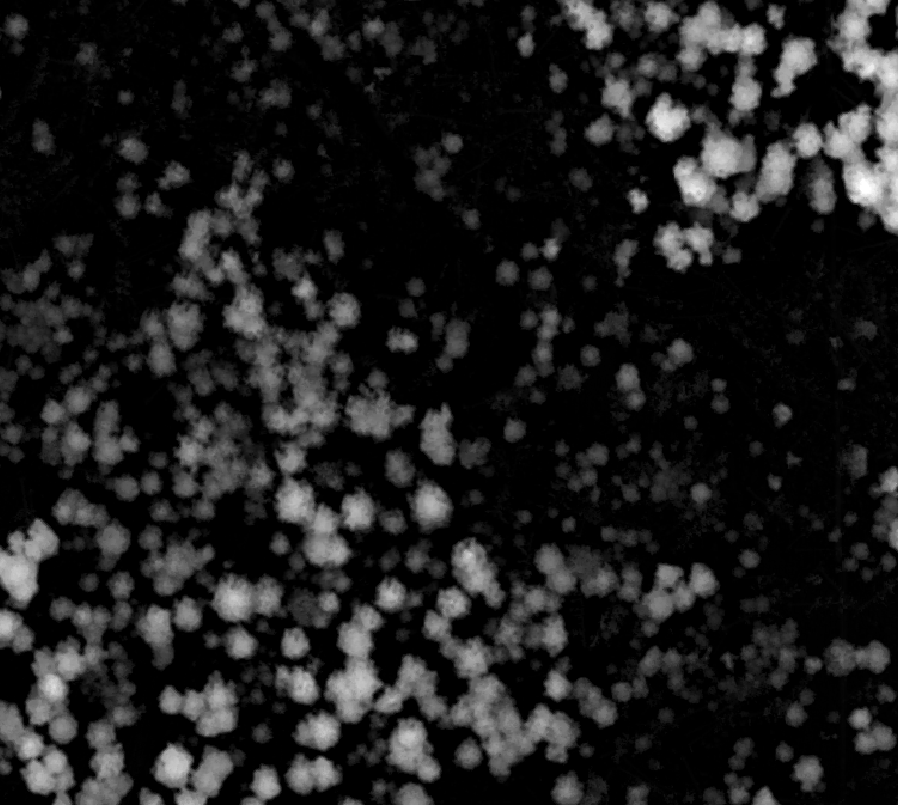

# **chm_prep**

## What chm_prep does

High resolution airborne lidar Canopy Height Models (CHMs), or Digital Surface Models (DSM) often present **small cavities** over forest canopies (figure 1a and 2a further down). These are caused by laser pulses travelling deep below the generalized *crown envelope* and generating low returns. They may also show **spikes** (figure 1a) caused by high noise if it was not properly removed from the point cloud before creating rasters products such as CHMs. Finally, no-data areas or **isolated no-data pixels** (figure 2a)
 may also cause problems. **chm_prep** does several things to improve CHMs or DSMs before they are used for, say, individual tree crown (ITC) extraction, or image orthorectification when a lidar DSM constitutes the 3D source. It was designed to:
- removes cavities and spikes;
- saturate the values to a minimum (e.g., 0.0 m for a CHM) and to a maximum, if desired;
- get rid of isolated no-data pixels.

It **leaves all non-problematic pixels unchanged**, so it is quite more targeted than, say, a simple median filter applied to an entire CHM. See results in figures 1b and 2b below. Moreover, it is made for production, so it runs very fast, and is by default a batch mode processor, processing all the tiles stored in a directory. The user controls all the processing parameters though an `.ini` file.

**Figure 1a: this CHM contains cavities and spikes (isolated bright pixels):**
 
**Figure 1b: CHM in figure 1a processed with chm_prep (cavities and spikes have been removed):**

**Figure 2a: this CHM contains cavities and isolated no-data pixels (in red, can you spot them?!):**
 
**Figure 2b: CHM in figure 2a processed with chm_prep (cavities and no-data pixels have been removed):**

## Installing chm_prep

### Code structure

chm_prep is made of a Python script (`chm_prep.py`) which is responsible for the I/O, the no-data management, and for launching the core cavity filling and spike removing algorithm, which, for efficiency reasons, is coded in C (`chm_prep.c`) and compiled to a shared library (`chm_prep.so`) called by the Python script.

### Installation

To install, place the .py and .so files in the same directory. Make sure to put the .so file corresponding to your OS (GNU/Linux or Windows).

#### Python dependencies
The Python script has the following external dependencies:
- numpy
- gdal (osgeo)

Please make sure these packages are installed in your Python environment.

### Compiling from source

If you prefer to compile for source (chm_prep.c), make sure to compile to a shared library. We hereby provide a single example of a compile command (for gcc):

    gcc -shared -o chm_prep.so -fPIC chm_prep.c

## Principles of the filtering algorithm

Before we explain how to use chm_prep, let's take a look at the algorithm steps:
- run a Laplacian filter having a kernel size of *x* pixels;
- apply a threshold to the results to detect cavities;
- apply a different threshold to the results to detect spikes;
- optionally, dilate the detected anomalous pixel regions to remove the pixels in the immediate surroundings of the anomalous ones (dilation is usually 0 or 1 pixel, using a larger number will modify too many "good" pixels).
- fill in the holes left by the removal of the anomalous pixels by interpolating the values found on each hole's periphery (this is why dilation is sometimes useful as it prevents the interpolation of pixels of low quality);
- apply a median filter to the filled areas to smooth the interpolated values.

The algorithm can be applied in a single pass, or two passes. For high resolution models (e.g. a 25 cm, or 10 cm CHM), two passes are recommended. The first pass uses a bigger Laplacian kernel to get rid of larger cavities (or spikes), while the second pass targets the small pits and spikes. The user controls the number of passes and the parameter values of each.

The values of all non-anomalous pixels values are conserved.

## Using chm_prep

To run chm_prep, adjust the parameter values in the `chm_prep.ini` file, save it, and run the Python script:

    python3 chm_prep.py

### The `chm_prep.ini` file

The chm_prep.ini file contains all the user parameters controlling the I/O and those of the algorithm. A template `chm_prep.ini` with "factory settings" is provided. It also contains inline comments to help the user properly fill-in all the values. Make sure to follow the formatting standards in this template (e.g., no quotation marks around paths, etc.).

#### Input/Output parameters

All .tif files in the `source_dir` will be processed. The results will be written to the `dest_dir`. The `_prep` suffix (for "_prep") will be added to the original file names. The `dest_dir` will be created if it does not exist.

#### Filtering parameters

The filtering parameters are written on a single comma-delimited line, one line per pass (see the *Principle of the filtering algorithm section* for a description of passes). The order of the filtering parameters on a line is as follow:
- size of the Laplacian filter kernel (integer value, in pixels);
- threshold Laplacian value for detecting a cavity (all values above this value will be considered a cavity) - a positive float value;
- threshold Laplacian value for detecting a spike (all values below this value will be considered a spike) - a negative float value;
- size of the median filter kernel (integer value, in pixels).
- dilation radius (integer value, in pixels).

Typical values for two passes for a 25 cm CHM could be:

- `pass1_params=5,0.1,-0.1,3,0`
- `pass2_params=3,0.1,-0.1,3,0`

Typical values for a single pass over a 50 cm CM could be:

- `pass1_params=5,0.1,-0.1,3,0`

The number of passes (one or two) is controlled by the presence or absence of the pass2_params line.

We recommend to run some tests on a small number of CHMs or DSMs before launching a large batch.

#### Saturation parameters

The user can decide to saturate the values to a minimum, for example to avoid CHM values to be below 0 m. The user can also choose to set a maximum for a CHM. This may help removing high noise that was not filtered out from the point cloud or limit the anomalous values caused by tree crowns hanging over a steep slope.
First, the following parameters must be set to True or False:
- `force_min_val`
- `force_max_val`

Then set the values of the min and max if the above parameters were set to True, e.g.:
- `min_val=0.0`
- `max_val=40.0`

#### no-data parameters

No-data pixels can be present in a CHM or DSM for a variety of reasons: part of a tile was not scanned, pulses reaching a water body did not trigger a return, or the interpolation algorithm used to rasterize the lidar returns left a few isolated no-data values. These can create problems in the downstream processing steps (e.g., for ITC, etc.). What is more, some no-data values represent extreme or non-existing mathematical numbers, such as minus infinity or NaN (Not a Number), which sometimes leads to undesired behavior. chm_prep lets the user keep, filter or modify any no-data pixels using three different schemes:
- transfer
- set_to_zero
- remove_small_holes

The first option, `transfer`, simply leaves the no-data pixels intact (but the user can change their values using the output_nodata_val parameter). The `set_to_zero` option will change the no-data pixels to zero. This can be practical for setting no-data values over a water body in a CHM to 0.0 m instead of having no-data in these areas, but we don't recommend this option for other use cases. Finally, the `remove_small_holes` option will leave the large no-data areas intact but will get rid of single pixel or small regions of no-data, such as those generated by certain rasterizing algorithms. The user must then provide a value for the `hole_size_thr` (hole size threshold) parameter, e.g.:
- `hole_size_thr=9`

Holes having a pixel area smaller than `hole_size_thr` will be filled. The value of `hole_size_thr` must be an integer representing the number of pixels (pixel area) in individual no-data holes to be used as a threshold.

## Tile size, memory management, buffering and CRS

chm_prep is designed for the standard case where a large lidar project is divided in rather small tiles (1 km x 1 km, 2 km x 2 km, etc.). Running chm_prep on a very large file could cause the program to exit because it would be out of memory. Moreover, edge effects can occur where cavities are very close to the edge of a raster lidar tile. Cavities or spikes might be left undetected in these slim areas. For this reason, it is recommended to buffer the tiles by at least the amount of pixels of the largest Lapalian kernel width before running chm_prep. The filtered output rasters can be cut back to their cores and eventually mosaicked. Finally, the coordinate reference system (CRS) must be defined within the input .tif files.

## Demo data

Demo data for testing chm_prep can be found [here](https://github.com/Geophoton-inc/chm_prep/tree/main/demo_data).
- `demo_CHM_1.tif` contains cavities and spikes;
- `demo_CHM_2.tif` contains cavities and isolated no-data pixels.

## Issues and bug reports

If you encounter issues or bugs, please create an issue by clicking [here](https://github.com/Geophoton-inc/chm_prep/issues).

## Contacting the author

You can email the author, Benoît St-Onge, at bstonge@protonmail.com or bso@geophoton.ca.

## Please give us credit

When using chm_prep, please use the following citation:

St-Onge, B. (2023). chm_prep, an application for removing cavities and spikes from lidar CHMs and DSMs [Software]. Available from https://github.com/Geophoton-inc/chm_prep.

You can also cite the original papers:

The core algorithm was first published in:
St-Onge, B., 2008. Methods for improving the quality of a true orthomosaic of Vexcel UltraCam images created using alidar digital surface model, Proceedings of the Silvilaser 2008, Edinburg, 555-562.# https://citeseerx.ist.psu.edu/document?repid=rep1&type=pdf&doi=81365288221f3ac34b51a82e2cfed8d58defb10e

A related version of the algorithm was later published in:
Ben-Arie, J. R., G. J. Hay, R. P. Powers, G. Castilla et B. St-Onge, 2009. Development and Evaluation of a Pit Filling
Algorithm for LiDAR Canopy Height Models, IEEE Transactions on Computers and Geosciences, 35:1940-1949
https://www.sciencedirect.com/science/article/abs/pii/S0098300409000624

## Licence

chm_prep is distributed under the GNU General public licence. Please consult the [licence file](LICENSE).

October 12th, 2023